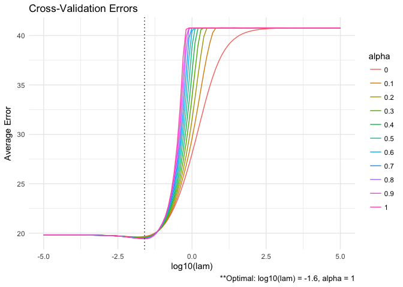

ADMMsigma
================

[](https://travis-ci.org/MGallow/ADMMsigma)
[](https://cran.r-project.org/package=ADMMsigma)

## Overview

`ADMMsigma` is an R package that estimates a penalized precision matrix
via the alternating direction method of multipliers (ADMM) algorithm. It
currently supports a general elastic-net penalty that allows for both
ridge and lasso-type penalties as special
cases.

<p align="center">


</p>

A (possibly incomplete) list of functions contained in the package can
be found below:

  - `ADMMsigma()` computes the estimated precision matrix (ridge, lasso,
    and elastic-net type regularization optional)

  - `RIDGEsigma()` computes the estimated ridge penalized precision
    matrix via closed-form solution

  - `plot.ADMMsigma()` produces a heat map or line graph for cross
    validation errors

  - `plot.RIDGEsigma()` produces a heat map or line graph for cross
    validation errors

See package [website](https://mgallow.github.io/ADMMsigma/) or
[manual](https://github.com/MGallow/ADMMsigma/blob/master/ADMMsigma.pdf).

## Installation

``` r
# The easiest way to install is from CRAN
install.packages("ADMMsigma")

# You can also install the development version from GitHub:
# install.packages("devtools")
devtools::install_github("MGallow/ADMMsigma")
```

If there are any issues/bugs, please let me know:
[github](https://github.com/MGallow/ADMMsigma/issues). You can also
contact me via my [website](https://mgallow.github.io/). Pull requests
are welcome\!

## Usage

``` r
library(ADMMsigma)

# generate data from a sparse oracle precision matrix
# we will try to estimate this matrix from the data

# first compute the oracle covariance matrix
S = matrix(0.7, nrow = 5, ncol = 5)
for (i in 1:5){
  for (j in 1:5){
    S[i, j] = S[i, j]^abs(i - j)
  }
}

# print oracle precision matrix
# because its sparse, some shrinkage might be useful
(Omega = round(qr.solve(S), 3))
```

    ##        [,1]   [,2]   [,3]   [,4]   [,5]
    ## [1,]  1.961 -1.373  0.000  0.000  0.000
    ## [2,] -1.373  2.922 -1.373  0.000  0.000
    ## [3,]  0.000 -1.373  2.922 -1.373  0.000
    ## [4,]  0.000  0.000 -1.373  2.922 -1.373
    ## [5,]  0.000  0.000  0.000 -1.373  1.961

``` r
# generate 100 x 5 data matrix with rows drawn from iid N_p(0, S)
set.seed(123)
Z = matrix(rnorm(100*5), nrow = 100, ncol = 5)
out = eigen(S, symmetric = TRUE)
S.sqrt = out$vectors %*% diag(out$values^0.5) %*% t(out$vectors)
X = Z %*% S.sqrt


# print sample precision matrix from the data
# this is perhaps a bad estimate (its not sparse)
Sample = (nrow(X) - 1)/nrow(X)*cov(X)
round(qr.solve(Sample), 5)
```

    ##          [,1]     [,2]     [,3]     [,4]     [,5]
    ## [1,]  2.32976 -1.55033  0.22105 -0.08607  0.24309
    ## [2,] -1.55033  3.27561 -1.68026 -0.14277  0.18949
    ## [3,]  0.22105 -1.68026  3.19897 -1.25158 -0.11016
    ## [4,] -0.08607 -0.14277 -1.25158  2.76790 -1.37226
    ## [5,]  0.24309  0.18949 -0.11016 -1.37226  2.05377

``` r
# now use ADMMsigma to provide estimates
# elastic-net type penalty (set tolerance to 1e-8)
ADMMsigma(X, tol.abs = 1e-8, tol.rel = 1e-8)
```

    ## 
    ## Call: ADMMsigma(X = X, tol.abs = 1e-08, tol.rel = 1e-08)
    ## 
    ## Iterations: 48
    ## 
    ## Tuning parameters:
    ##       log10(lam)  alpha
    ## [1,]      -1.599      1
    ## 
    ## Log-likelihood: -108.41003
    ## 
    ## Omega:
    ##          [,1]     [,2]     [,3]     [,4]     [,5]
    ## [1,]  2.15283 -1.26902  0.00000  0.00000  0.19765
    ## [2,] -1.26902  2.79032 -1.32206 -0.08056  0.00925
    ## [3,]  0.00000 -1.32206  2.85470 -1.17072 -0.00865
    ## [4,]  0.00000 -0.08056 -1.17072  2.49554 -1.18959
    ## [5,]  0.19765  0.00925 -0.00865 -1.18959  1.88121

``` r
# lasso penalty (default tolerance)
ADMMsigma(X, alpha = 1)
```

    ## 
    ## Call: ADMMsigma(X = X, alpha = 1)
    ## 
    ## Iterations: 24
    ## 
    ## Tuning parameters:
    ##       log10(lam)  alpha
    ## [1,]      -1.599      1
    ## 
    ## Log-likelihood: -108.41193
    ## 
    ## Omega:
    ##          [,1]     [,2]     [,3]     [,4]     [,5]
    ## [1,]  2.15308 -1.26962  0.00000  0.00000  0.19733
    ## [2,] -1.26962  2.79103 -1.32199 -0.08135  0.00978
    ## [3,]  0.00000 -1.32199  2.85361 -1.16953 -0.00921
    ## [4,]  0.00000 -0.08135 -1.16953  2.49459 -1.18914
    ## [5,]  0.19733  0.00978 -0.00921 -1.18914  1.88096

``` r
# elastic-net penalty (alpha = 0.5)
ADMMsigma(X, alpha = 0.5)
```

    ## 
    ## Call: ADMMsigma(X = X, alpha = 0.5)
    ## 
    ## Iterations: 20
    ## 
    ## Tuning parameters:
    ##       log10(lam)  alpha
    ## [1,]      -1.821    0.5
    ## 
    ## Log-likelihood: -101.13591
    ## 
    ## Omega:
    ##          [,1]     [,2]     [,3]     [,4]     [,5]
    ## [1,]  2.20055 -1.32510  0.01689 -0.00350  0.21805
    ## [2,] -1.32510  2.90739 -1.37666 -0.19054  0.13642
    ## [3,]  0.01689 -1.37666  2.92556 -1.12877 -0.12032
    ## [4,] -0.00350 -0.19054 -1.12877  2.56559 -1.23466
    ## [5,]  0.21805  0.13642 -0.12032 -1.23466  1.94525

``` r
# ridge penalty
ADMMsigma(X, alpha = 0)
```

    ## 
    ## Call: ADMMsigma(X = X, alpha = 0)
    ## 
    ## Iterations: 31
    ## 
    ## Tuning parameters:
    ##       log10(lam)  alpha
    ## [1,]      -1.821      0
    ## 
    ## Log-likelihood: -99.19745
    ## 
    ## Omega:
    ##          [,1]     [,2]     [,3]     [,4]     [,5]
    ## [1,]  2.18987 -1.31545  0.04524 -0.04093  0.23512
    ## [2,] -1.31545  2.90045 -1.37070 -0.22626  0.17807
    ## [3,]  0.04524 -1.37070  2.89459 -1.07653 -0.17369
    ## [4,] -0.04093 -0.22626 -1.07653  2.55028 -1.22785
    ## [5,]  0.23512  0.17807 -0.17369 -1.22785  1.95494

``` r
# ridge penalty (using closed-form solution)
RIDGEsigma(X, lam = 10^seq(-8, 8, 0.01))
```

    ## 
    ## Call: RIDGEsigma(X = X, lam = 10^seq(-8, 8, 0.01))
    ## 
    ## Tuning parameter:
    ##       log10(lam)    lam
    ## [1,]       -2.17  0.007
    ## 
    ## Log-likelihood: -109.18156
    ## 
    ## Omega:
    ##          [,1]     [,2]     [,3]     [,4]     [,5]
    ## [1,]  2.15416 -1.31185  0.08499 -0.05571  0.22862
    ## [2,] -1.31185  2.85605 -1.36677 -0.19650  0.16880
    ## [3,]  0.08499 -1.36677  2.82606 -1.06325 -0.14946
    ## [4,] -0.05571 -0.19650 -1.06325  2.50721 -1.21935
    ## [5,]  0.22862  0.16880 -0.14946 -1.21935  1.92871

``` r
# produce CV heat map for ADMMsigma
ADMM = ADMMsigma(X, lam = 10^seq(-5, 5, 0.1), alpha = seq(0, 1, 0.1))
plot(ADMM, type = "heatmap")
```

<!-- -->

``` r
# produce line graph for CV errors for ADMMsigma
plot(ADMM, type = "line")
```

<!-- -->

``` r
# produce CV heat map for RIDGEsigma
RIDGE = RIDGEsigma(X, lam = 10^seq(-8, 8, 0.01))
plot(RIDGE, type = "heatmap")
```

<!-- -->

``` r
# produce line graph for CV errors for RIDGEsigma
plot(RIDGE, type = "line")
```

<!-- -->
