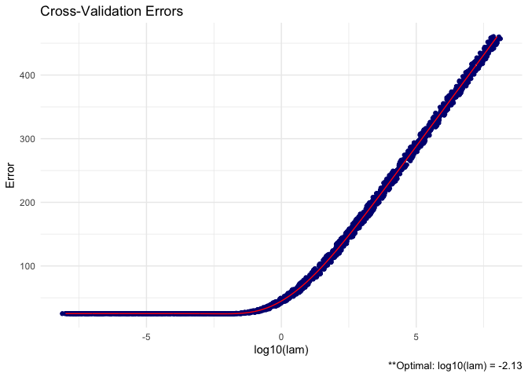

ADMMsigma
================

See [vignette](https://mgallow.github.io/ADMMsigma/) or [manual](https://github.com/MGallow/ADMMsigma/blob/master/ADMMsigma.pdf).

Overview
--------

<br>

<p align="center">

</p>
<br>

`ADMMsigma` is an R package that estimates a penalized precision matrix via the alternating direction method of multipliers (ADMM) algorithm. It currently supports a general elastic-net penalty that allows for both ridge and lasso-type penalties as special cases. A (possibly incomplete) list of functions contained in the package can be found below:

-   `ADMMsigma()` computes the estimated precision matrix (ridge, lasso, and elastic-net type regularization optional)

-   `RIDGEsigma()` computes the estimated ridge penalized precision matrix via closed-form solution

-   `plot.ADMMsigma()` produces a heat map or line graph for cross validation errors

-   `plot.RIDGEsigma()` produces a heat map or line graph for cross validation errors

Installation
------------

``` r
# The easiest way to install is from CRAN
install.packages("ADMMsigma")

# You can also install the development version from GitHub:
# install.packages("devtools")
devtools::install_github("MGallow/ADMMsigma")
```

If there are any issues/bugs, please let me know: [github](https://github.com/MGallow/ADMMsigma/issues). You can also contact me via my [website](http://users.stat.umn.edu/~gall0441/). Pull requests are welcome!

Usage
-----

``` r
library(ADMMsigma)

# generate data from a sparse matrix
# first compute covariance matrix
S = matrix(0.7, nrow = 5, ncol = 5)
for (i in 1:5){
  for (j in 1:5){
    S[i, j] = S[i, j]^abs(i - j)
  }
}

# print oracle precision matrix (shrinkage might be useful)
(Omega = qr.solve(S) %>% round(3))
```

    ##        [,1]   [,2]   [,3]   [,4]   [,5]
    ## [1,]  1.961 -1.373  0.000  0.000  0.000
    ## [2,] -1.373  2.922 -1.373  0.000  0.000
    ## [3,]  0.000 -1.373  2.922 -1.373  0.000
    ## [4,]  0.000  0.000 -1.373  2.922 -1.373
    ## [5,]  0.000  0.000  0.000 -1.373  1.961

``` r
# generate 1000 x 5 matrix with rows drawn from iid N_p(0, S)
Z = matrix(rnorm(100*5), nrow = 100, ncol = 5)
out = eigen(S, symmetric = TRUE)
S.sqrt = out$vectors %*% diag(out$values^0.5) %*% t(out$vectors)
X = Z %*% S.sqrt


# print sample precision matrix (perhaps a bad estimate)
(qr.solve(cov(X)) %>% round(5))
```

    ##          [,1]     [,2]     [,3]     [,4]     [,5]
    ## [1,]  2.01049 -1.46789  0.22914 -0.37500  0.22434
    ## [2,] -1.46789  3.05256 -1.60716  0.30689 -0.25087
    ## [3,]  0.22914 -1.60716  2.86518 -1.19531 -0.00722
    ## [4,] -0.37500  0.30689 -1.19531  2.70120 -1.23124
    ## [5,]  0.22434 -0.25087 -0.00722 -1.23124  1.94731

``` r
# elastic-net type penalty (set tolerance to 1e-8)
ADMMsigma(X, tol.abs = 1e-8, tol.rel = 1e-8)
```

    ## 
    ## Call: ADMMsigma(X = X, tol.abs = 1e-08, tol.rel = 1e-08)
    ## 
    ## Iterations: 116
    ## 
    ## Tuning parameters:
    ##       log10(lam)  alpha
    ## [1,]      -1.433      1
    ## 
    ## Log-likelihood: -130.98332
    ## 
    ## Omega:
    ##          [,1]     [,2]     [,3]     [,4]     [,5]
    ## [1,]  1.80403 -1.14556  0.00000 -0.11027  0.00000
    ## [2,] -1.14556  2.53966 -1.20362  0.00000 -0.04495
    ## [3,]  0.00000 -1.20362  2.46937 -0.92583 -0.08241
    ## [4,] -0.11027  0.00000 -0.92583  2.35472 -1.01653
    ## [5,]  0.00000 -0.04495 -0.08241 -1.01653  1.78141

``` r
# lasso penalty (default tolerance)
ADMMsigma(X, alpha = 1)
```

    ## 
    ## Call: ADMMsigma(X = X, alpha = 1)
    ## 
    ## Iterations: 52
    ## 
    ## Tuning parameters:
    ##       log10(lam)  alpha
    ## [1,]      -1.433      1
    ## 
    ## Log-likelihood: -130.98406
    ## 
    ## Omega:
    ##          [,1]     [,2]     [,3]     [,4]     [,5]
    ## [1,]  1.80324 -1.14449  0.00000 -0.11075  0.00000
    ## [2,] -1.14449  2.53691 -1.20174  0.00000 -0.04500
    ## [3,]  0.00000 -1.20174  2.46641 -0.92423 -0.08296
    ## [4,] -0.11075  0.00000 -0.92423  2.35258 -1.01548
    ## [5,]  0.00000 -0.04500 -0.08296 -1.01548  1.78086

``` r
# elastic-net penalty (alpha = 0.5)
ADMMsigma(X, alpha = 0.5)
```

    ## 
    ## Call: ADMMsigma(X = X, alpha = 0.5)
    ## 
    ## Iterations: 50
    ## 
    ## Tuning parameters:
    ##       log10(lam)  alpha
    ## [1,]      -1.433    0.5
    ## 
    ## Log-likelihood: -126.82414
    ## 
    ## Omega:
    ##          [,1]     [,2]     [,3]     [,4]     [,5]
    ## [1,]  1.79866 -1.12806  0.00000 -0.16207  0.04420
    ## [2,] -1.12806  2.50858 -1.16764  0.00000 -0.07807
    ## [3,]  0.00000 -1.16764  2.43966 -0.88994 -0.12531
    ## [4,] -0.16207  0.00000 -0.88994  2.34203 -0.99485
    ## [5,]  0.04420 -0.07807 -0.12531 -0.99485  1.78992

``` r
# ridge penalty
ADMMsigma(X, alpha = 0)
```

    ## 
    ## Call: ADMMsigma(X = X, alpha = 0)
    ## 
    ## Iterations: 66
    ## 
    ## Tuning parameters:
    ##       log10(lam)  alpha
    ## [1,]      -1.877      0
    ## 
    ## Log-likelihood: -116.33901
    ## 
    ## Omega:
    ##          [,1]     [,2]     [,3]     [,4]     [,5]
    ## [1,]  1.91637 -1.28550  0.07043 -0.27500  0.17392
    ## [2,] -1.28550  2.76590 -1.34569  0.11831 -0.17411
    ## [3,]  0.07043 -1.34569  2.64866 -1.01428 -0.10200
    ## [4,] -0.27500  0.11831 -1.01428  2.53711 -1.11972
    ## [5,]  0.17392 -0.17411 -0.10200 -1.11972  1.89321

``` r
# ridge penalty no ADMM
RIDGEsigma(X, lam = 10^seq(-8, 8, 0.01))
```

    ## 
    ## Call: RIDGEsigma(X = X, lam = 10^seq(-8, 8, 0.01))
    ## 
    ## Tuning parameter:
    ##       log10(lam)    lam
    ## [1,]       -1.95  0.011
    ## 
    ## Log-likelihood: -132.86643
    ## 
    ## Omega:
    ##          [,1]     [,2]     [,3]     [,4]     [,5]
    ## [1,]  1.82061 -1.17963  0.04463 -0.25807  0.15741
    ## [2,] -1.17963  2.54895 -1.21046  0.09604 -0.16570
    ## [3,]  0.04463 -1.21046  2.44693 -0.91966 -0.10641
    ## [4,] -0.25807  0.09604 -0.91966  2.36358 -1.03460
    ## [5,]  0.15741 -0.16570 -0.10641 -1.03460  1.80536

``` r
# produce CV heat map for ADMMsigma
ADMM = ADMMsigma(X, lam = 10^seq(-5, 5, 0.1), alpha = seq(0, 1, 0.1))
ADMM %>% plot(type = "heatmap")
```


``` r
# produce line graph for CV errors for ADMMsigma
ADMM %>% plot(type = "line")
```


``` r
# produce CV heat map for RIDGEsigma
RIDGE = RIDGEsigma(X, lam = 10^seq(-8, 8, 0.01))
RIDGE %>% plot
```


``` r
# produce line graph for CV errors for RIDGEsigma
RIDGE %>% plot(type = "line")
```


