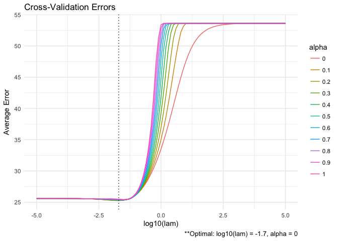

ADMMsigma
================

See [vignette](https://mgallow.github.io/ADMMsigma/) or [manual](https://github.com/MGallow/ADMMsigma/blob/master/ADMMsigma.pdf).

Overview
--------

<br>

<p align="center">

</p>
<br>

`ADMMsigma` is an R package that estimates a penalized precision matrix via the alternating direction method of multipliers (ADMM) algorithm. A (possibly incomplete) list of functions contained in the package can be found below:

-   `ADMMsigma()` computes the estimated precision matrix (ridge, lasso, and elastic-net type regularization optional)

-   `RIDGEsigma()` computes the estimated ridge penalized precision matrix via closed-form solution

-   `plot.ADMMsigma()` produces a heat map for cross validation errors

-   `plot.RIDGEsigma()` produces a heat map for cross validation errors

Installation
------------

``` r
# The easiest way to install is from CRAN
install.packages("ADMMsigma")

# You can also install the development version from GitHub:
# install.packages("devtools")
devtools::install_github("MGallow/ADMMsigma")
```

If there are any issues/bugs, please let me know: [github](https://github.com/MGallow/ADMMsigma/issues). You can also contact me via my [website](http://users.stat.umn.edu/~gall0441/). Pull requests are welcome!

Usage
-----

``` r
library(ADMMsigma)

#  generate data from a dense matrix
# first compute covariance matrix
S = matrix(0.9, nrow = 5, ncol = 5)
diag(S) = 1

# generate 100 x 5 matrix with rows drawn from iid N_p(0, S)
Z = matrix(rnorm(100*5), nrow = 100, ncol = 5)
out = eigen(S, symmetric = TRUE)
S.sqrt = out$vectors %*% diag(out$values^0.5) %*% t(out$vectors)
X = Z %*% S.sqrt


# elastic-net type penalty (use CV for optimal lambda and alpha)
ADMMsigma(X)
```

    ## 
    ## Iterations:
    ## [1] 45
    ## 
    ## Tuning parameters:
    ##       log10(lam)  alpha
    ## [1,]          -3      0
    ## 
    ## Omega:
    ##          [,1]     [,2]     [,3]     [,4]     [,5]
    ## [1,]  8.31371 -2.90860 -1.04986 -1.76890 -2.09920
    ## [2,] -2.90860  7.68723 -2.15920 -1.08226 -1.34948
    ## [3,] -1.04986 -2.15920  9.26522 -3.41041 -2.02734
    ## [4,] -1.76890 -1.08226 -3.41041  7.25467 -1.37497
    ## [5,] -2.09920 -1.34948 -2.02734 -1.37497  7.22164

``` r
# ridge penalty (use CV for optimal lambda)
ADMMsigma(X, alpha = 0)
```

    ## 
    ## Iterations:
    ## [1] 45
    ## 
    ## Tuning parameters:
    ##       log10(lam)  alpha
    ## [1,]          -3      0
    ## 
    ## Omega:
    ##          [,1]     [,2]     [,3]     [,4]     [,5]
    ## [1,]  8.31371 -2.90860 -1.04986 -1.76890 -2.09920
    ## [2,] -2.90860  7.68723 -2.15920 -1.08226 -1.34948
    ## [3,] -1.04986 -2.15920  9.26522 -3.41041 -2.02734
    ## [4,] -1.76890 -1.08226 -3.41041  7.25467 -1.37497
    ## [5,] -2.09920 -1.34948 -2.02734 -1.37497  7.22164

``` r
# lasso penalty (lam = 0.1)
ADMMsigma(X, lam = 0.1, alpha = 1)
```

    ## 
    ## Iterations:
    ## [1] 10
    ## 
    ## Tuning parameters:
    ##       log10(lam)  alpha
    ## [1,]          -1      1
    ## 
    ## Omega:
    ##          [,1]     [,2]     [,3]     [,4]     [,5]
    ## [1,]  2.85752 -0.75351 -0.49811 -0.61800 -0.63404
    ## [2,] -0.75351  2.74827 -0.63622 -0.54697 -0.54880
    ## [3,] -0.49811 -0.63622  2.97287 -0.84757 -0.61785
    ## [4,] -0.61800 -0.54697 -0.84757  2.62120 -0.58128
    ## [5,] -0.63404 -0.54880 -0.61785 -0.58128  2.70924

``` r
# ridge penalty no ADMM
RIDGEsigma(X, lam = 10^seq(-8, 8, 0.01))
```

    ## 
    ## Tuning parameter:
    ##         lam  log10(lam)
    ## [1,]  0.001       -2.85
    ## 
    ## Omega:
    ##          [,1]     [,2]     [,3]     [,4]     [,5]
    ## [1,]  8.01213 -2.75544 -1.05598 -1.71067 -2.01223
    ## [2,] -2.75544  7.43304 -2.06086 -1.09126 -1.33140
    ## [3,] -1.05598 -2.06086  8.87527 -3.21753 -1.94302
    ## [4,] -1.71067 -1.09126 -3.21753  7.01863 -1.35883
    ## [5,] -2.01223 -1.33140 -1.94302 -1.35883  7.01519

``` r
# produce CV heat map for ADMMsigma
ADMMsigma(X) %>% plot
```


``` r
# produce CV heat map for RIDGEsigma
RIDGEsigma(X, lam = 10^seq(-8, 8, 0.01)) %>% plot
```


